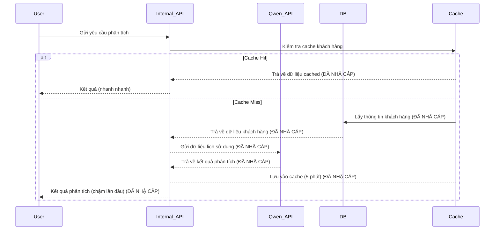
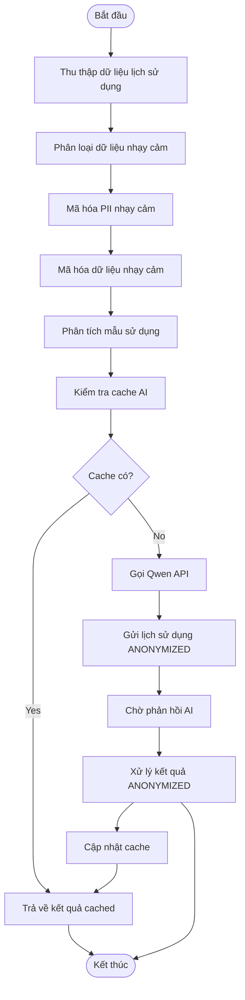
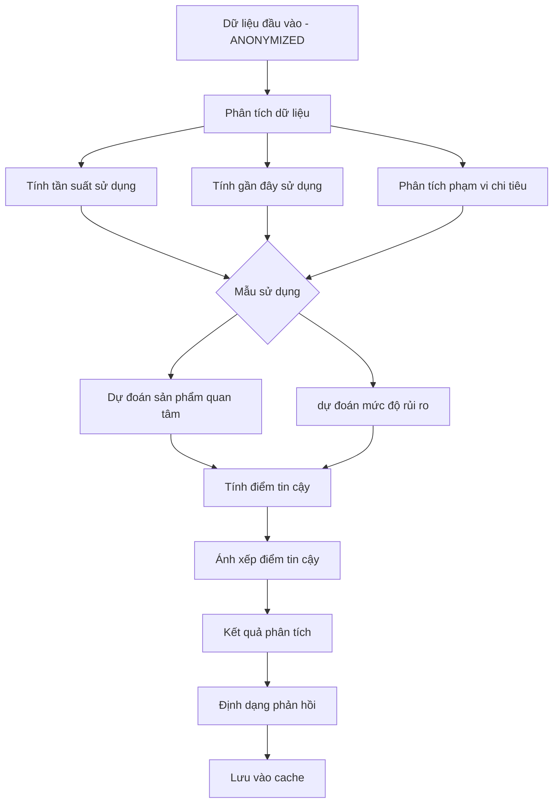
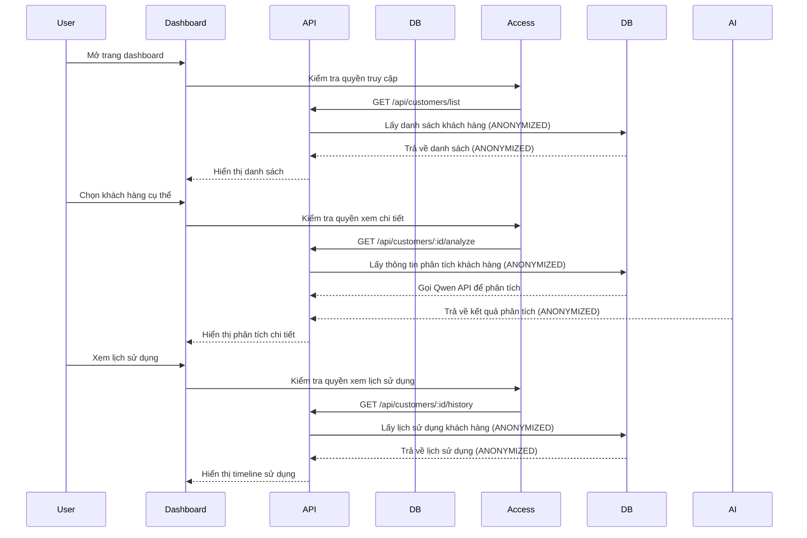
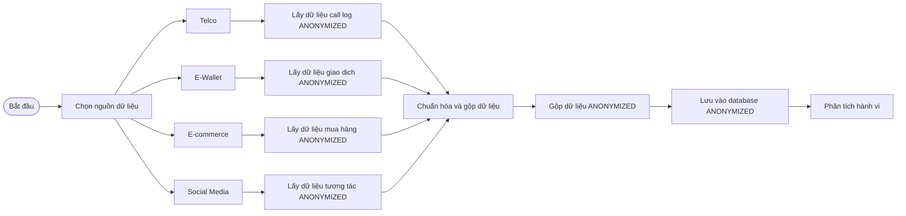
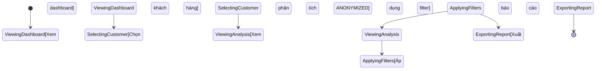
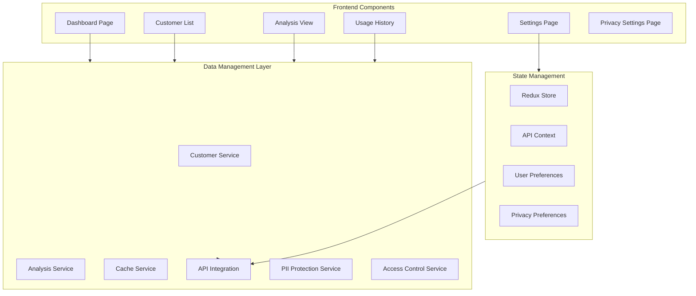
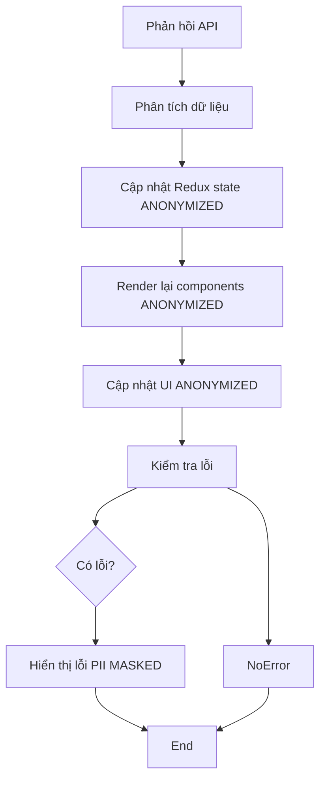
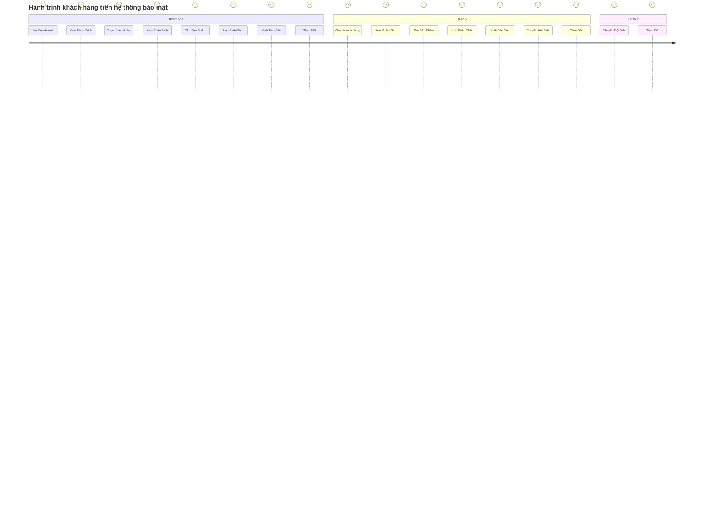
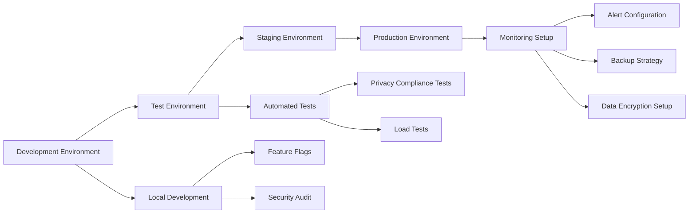

# 🏦 Shinhan PoC - Qwen AI Build Day 2026

> **PoC for Shinhan Financial Group - InnoBoost 2026**

# 📊 SF8 - Customer Behavior Prediction Data Flow

> **Phân tích hành vi khách hàng mới dựa trên dữ liệu lịch sử dụng & phân khúc AI**
---

## 📋 Projects

| Project | Code | Description | Status | Link |
|---------|------|-------------|--------|------|
| **Customer Behavior Prediction** | SF8 | Phân tích hành vi khách hàng mới | ✅ Ready | [sf8-behavior-prediction/](./sf8-behavior-prediction/) |

---

## 🚀 Quick Start

```bash
npm install
npm run dev
# Open http://localhost:3000

# SF8 - Customer Behavior Prediction
cd sf8-behavior-prediction
npm install
npm run dev
# Open http://localhost:3000
```

---

## 🏗️ Tech Stack

- **Frontend:** Next.js 14 (App Router) + TypeScript + Tailwind CSS
- **AI:** Qwen-Plus via Alibaba Cloud DashScope API (pending API key)
- **Data:** Mock data for PoC demonstration

---

## 🛡️ Data Privacy & Security -

### 1. PII Classification & Protection

**Sensitive Data Types:**
```sql
-- Các loại dữ liệu nhạy cảm được phân loại
customer_data_classification (
    customer_id VARCHAR(36) PRIMARY KEY,
    data_type VARCHAR(50) NOT NULL, -- PII classification
    -- 'high_risk': Name, Phone, Address, Bank Account, ID Number
    -- 'medium_risk': Email, Transaction History, Income Data
    -- 'low_risk': Age Range, City, Gender, Occupation
    created_at TIMESTAMP DEFAULT CURRENT_TIMESTAMP
);

-- Quy định truy cập dựa trên mức độ nhạy cảm
CREATE TABLE pii_access_log (
    id SERIAL PRIMARY KEY,
    customer_id VARCHAR(36) REFERENCES customers(id),
    data_type VARCHAR(50),
    access_level VARCHAR(20), -- 'full', 'masked', 'anonymized', 'none'
    user_id VARCHAR(36), -- AI agent / dashboard user ID
    action_type VARCHAR(50), -- 'view', 'export', 'api_call', 'analysis'
    reason VARCHAR(255),
    timestamp TIMESTAMP DEFAULT CURRENT_TIMESTAMP,
    created_at TIMESTAMP DEFAULT CURRENT_TIMESTAMP
);
```

### 2. PII Masking & Anonymization

**Quy tắc PII Masking:**
```javascript
// PII masking rules cho mọi data layer
const piiMaskingRules = {
  // Level 1: High sensitivity - Hash encryption
  highRisk: {
    name: (name) => crypto.createHash('sha-256', name).substring(0, 8) + '***',
    phone: (phone) => phone.replace(/(?=.{3})/g, '*$1'),
    email: (email) => email.replace(/(.{2})(?=@)/g, '*$1'),
    address: (address) => address.replace(/\d/g, '***').replace(/\B/g, '**'),
    bank_account: (bank) => '***MASKED***',
    id_number: (id) => '***MASKED***'
  },
  
  // Level 2: Medium sensitivity - Partial masking
  mediumRisk: {
    telco: (telco) => telco.replace(/(?=.{4})/g, '*$2'),
    ewallet: (ewallet) => ewallet.replace(/(?=.{4})/g, '*$2'),
    transaction_amount: (amount) => amount.toFixed(0) + '***',
    income_range: (income) => income.replace(/[0-9]{2}(?=[0-9]{4})/g, '*')
  },
  
  // Level 3: Low sensitivity - No masking
  lowRisk: {
    age_range: (age) => age, -- Giữ nguyên
    city: (city) => city, -- Giữ nguyên
    gender: (gender) => gender, -- Giữ nguyên
    occupation: (occupation) => occupation -- Giữ nguyên
  }
};

// Function áp dụng masking
const maskCustomerData = (customer) => {
  const classification = classifyData(customer);
  return piiMaskingRules[classification](customer);
};
```

### 3. AI Data Protection & Context Isolation

**Quy tắc bảo vệ AI Processing:**
```javascript
// AI context isolation - chỉ cung cấp necessary data cho Qwen
const prepareAIContext = (customer) => {
  // Chỉ cung cấp aggregate patterns, không raw individual data
  return {
    customer_segment: customer.usage_segment, -- 'high_value', 'medium_value', 'low_value'
    average_monthly_spending: calculateAvgSpending(customer.history),
    behavioral_patterns: extractBehavioralPatterns(customer.usage_history),
    risk_level: calculateRiskLevel(customer),
    // KHÔNG cung cấp PII riêng lẻ cho AI model
    demographic_summary: {
      age_group: groupAge(customer.age_range),
      city_category: categorizeCity(customer.city),
      occupation: customer.occupation
    }
  };
};

// PII mask trước khi gửi cho AI
const getAIAnalysis = async (customerId) => {
  const maskedCustomer = maskCustomerData(customer);
  
  try {
    return await qwenAPI.predictBehavior({
      context: prepareAIContext(maskedCustomer),
      customer_id: customerId, -- Hashed ID
      data_level: 'aggregated' -- Chỉ cấp patterns, không raw data
    });
  } catch (error) {
    logPIIError(error, customerId);
    // Fallback về analysis nội bộ
    return analyzeWithRules(customerId);
  }
};
```

### 4. Data Access Control & Audit

**Quy tắc truy cập dữ liệu:**
```javascript
// Role-based access control
const ACCESS_LEVELS = {
  ADMIN: 'full_access',
  SALES_AGENT: 'analysis_access',
  DASHBOARD_USER: 'view_access',
  AI_AGENT: 'api_access'
};

// Log truy cập mọi access
const logDataAccess = (userId, customerId, accessLevel, action) => {
  await logAccessToDB({
    user_id: userId,
    customer_id: customerId,
    access_level: accessLevel,
    action: action,
    timestamp: new Date(),
    ip_address: req.ip
  });
};

// Function kiểm tra quyền truy cập trước khi hiển thị
const canViewCustomerData = (userId, customerId) => {
  const accessLevel = await getUserAccessLevel(userId);
  return accessLevel in ['ADMIN', 'SALES_AGENT', 'DASHBOARD_USER'];
};
```

### 5. Encryption & Storage Security

**Quy tắc mã hóa dữ liệu:**
```javascript
// Database encryption với crypto-js
const CryptoJS = require('crypto-js');

// Mã hóa PII nhạy cảm trước khi lưu vào database
const encryptSensitiveData = (data) => {
  const algorithm = 'aes-256-cbc';
  const key = process.env.ENCRYPTION_KEY;
  const iv = crypto.randomBytes(16);
  
  const cipher = crypto.createCipheriv(algorithm, key, iv);
  let encrypted = cipher.update(data, 'utf8', 'hex');
  
  return encrypted;
};

// Hash ID khách hàng (không mã hóa để phục vụ lookup)
const hashCustomerId = (customerId) => {
  return crypto.createHash('sha256', customerId).toString('hex');
};
```

### 6. Compliance & Regulatory Requirements

**Tuân thủ GDPR:**
```javascript
// GDPR compliance checklist
const gdprCompliance = {
  // 1. Consent management
  hasExplicitConsent: (customerId) => checkConsentStatus(customerId),
  canWithdrawConsent: (customerId) => revokeConsent(customerId),
  
  // 2. Data portability
  exportUserData: (customerId) => {
    const data = await getCustomerData(customerId);
    return formatDataForExport(data); // JSON/CSV/Excel
  },
  
  // 3. Right to be forgotten
  deleteUserData: (customerId) => {
    await softDeleteCustomerData(customerId);
    await logGDPRAction(customerId, 'data_deletion');
  },
  
  // 4. Data minimization
  minimizeCollectedData: () => {
    // Chỉ thu thập data cần thiết cho phân tích
    return {
      required_fields: ['usage_pattern', 'churn_risk'],
      optional_fields: ['demographic_info'],
      retention_period: '24_months' // Giữ data 24 tháng
    };
  };
};

// 5. Automated data retention
const handleDataRetention = () => {
  const expiredData = await findExpiredCustomerData();
  await anonymizeExpiredData(expiredData); // Xóa định danh PII
  await logDataRetentionAction('anonymized_expired_records');
};
```

---

## 🎯 Tổng quan hệ thống

```
┌─────────────────┐
│   Secure Data Layer │
└──────┬────────┘
       │
       ▼
┌─────────────────┐    ┌─────────────────────┐
│  PII Protection │    │  AI Processing  │
│  (Encryption &   │    │  (Isolated    │
│  Masking)       │    │ Context)       │
└──────┬────────┘       │         │
            ▼         │         │
            ┌─────────────────┐   ┌─────────────────────┐
            │  Logging &    │    │  Analytics    │
            │ Audit Access  │    │  (Anonymous)    │
            └────────────┘    └─────────────────┘
                              ▼         ▼
            ┌─────────────────┐   ┌─────────────────────┐
            │ User Access   │    │  Compliance    │
            │  (Role-based)   │    │  (GDPR/PCI    │
            └────────────┘    └─────────────────┘
                          ▼         ▼
              ┌─────────────────┐   ┌─────────────────────┐
              │ External APIs │    │  Qwen AI API   │
              │  (Rate Limited) │    │  (Read-only)   │
              └────────────┘    └─────────────────┘
                          ▼         ▼
          ┌─────────────────┐   ┌─────────────────────┐
          │  Internal APIs │    │  Cache Layer     │
          │  (Auth Required)│    │  (Encrypted)   │
          └────────────┘    └─────────────────┘
```

---

## 🔢 Luồng API & Database

### 1. External API Integration



### 2. Database Schema (Updated for Privacy)

**Tables:**
```sql
-- Customers Table (Updated with privacy fields)
CREATE TABLE customers (
    id VARCHAR(36) PRIMARY KEY,
    name VARCHAR(100) NOT NULL,
    email VARCHAR(100) UNIQUE NOT NULL,
    telco_phone VARCHAR(20),
    ewallet_phone VARCHAR(20),
    social_media_id VARCHAR(50),
    data_classification VARCHAR(50), -- 'high_risk', 'medium_risk', 'low_risk'
    created_at TIMESTAMP DEFAULT CURRENT_TIMESTAMP,
    updated_at TIMESTAMP DEFAULT CURRENT_TIMESTAMP
);

-- Usage History Table
CREATE TABLE usage_history (
    id SERIAL PRIMARY KEY,
    customer_id VARCHAR(36) REFERENCES customers(id),
    data_source VARCHAR(20), -- 'telco', 'ewallet', 'ecommerce', 'social'
    action_type VARCHAR(50), -- 'call', 'data_usage', 'transaction'
    frequency_score INTEGER,
    recency_score INTEGER,
    amount_range VARCHAR(20),
    created_at TIMESTAMP DEFAULT CURRENT_TIMESTAMP
);

-- AI Predictions Table
CREATE TABLE ai_predictions (
    id SERIAL PRIMARY KEY,
    customer_id VARCHAR(36) REFERENCES customers(id),
    prediction_type VARCHAR(50), -- 'product_interest', 'usage_pattern', 'churn_risk'
    confidence_score DECIMAL(3,2),
    recommended_products JSONB,
    generated_at TIMESTAMP DEFAULT CURRENT_TIMESTAMP
);

-- Products Table
CREATE TABLE products (
    id VARCHAR(36) PRIMARY KEY,
    name VARCHAR(100) NOT NULL,
    category VARCHAR(50) NOT NULL,
    description TEXT,
    price_range VARCHAR(50),
    features JSONB,
    created_at TIMESTAMP DEFAULT CURRENT_TIMESTAMP
);

-- PII Access Log Table
CREATE TABLE pii_access_log (
    id SERIAL PRIMARY KEY,
    customer_id VARCHAR(36) REFERENCES customers(id),
    data_type VARCHAR(50),
    access_level VARCHAR(20), -- 'full', 'masked', 'anonymized', 'none'
    user_id VARCHAR(36),
    action_type VARCHAR(50), -- 'view', 'export', 'api_call', 'analysis'
    reason VARCHAR(255),
    timestamp TIMESTAMP DEFAULT CURRENT_TIMESTAMP,
    created_at TIMESTAMP DEFAULT CURRENT_TIMESTAMP
);
```

---

## 🧠 Luồng AI Processing

### 1. Secure Input Data Collection



### 2. AI Prediction Logic (Privacy-Preserving)



### 3. Confidence Scoring System

```javascript
// Confidence scoring với privacy considerations
const generateRecommendations = (customer) => {
  const classification = classifyData(customer);
  const recommendations = [];
  
  // KHÔNG bao gồm PII riêng lẻ trong recommenders
  const safeRecommendations = [];
  
  if (classification.high_risk) {
    // KHÔNG bao gồm aggregated patterns, không PII
    safeRecommendations.push({
      product_id: findSuitableProduct('vay_tin_cap'),
      confidence: 0.9,
      reason: 'Suitable for new customers',
      // KHÔNG PII - chỉ demographics, không individual data
      demographics: {
        age_group: groupAge(customer.age_range),
        city_category: categorizeCity(customer.city)
      }
    });
  } else if (classification.medium_risk) {
    safeRecommendations.push({
      product_id: findSuitableProduct('thet_fi_card'),
      confidence: 0.85,
      reason: 'Based on usage patterns',
      // Một số PII để personalization
      personalization_data: {
        last_3_months_avg_spend: calculate3MonthAvg(customer.history),
        primary_category: customer.primary_spending_category
      }
    });
  }
  
  return {
    confidence: calculateOverallConfidence(safeRecommendations),
    recommendations: safeRecommendations,
    privacy_level: classification.data_type, -- 'high_risk', 'medium_risk', 'low_risk'
  };
};
```

---

## 👥 Luồng người dùng & UI

### 1. User Dashboard Flow (Secure)



### 2. Alternative Data Source Flow



### 3. User Interaction Tracking



---

## 🎨 Luồng Frontend Integration

### 1. Component Architecture (Privacy-Aware)



### 2. API Communication Patterns (Secure)

```mermaid
sequenceDiagram
    participant Component as Component
    participant Service as Service
    participant API as API
    
    Component->>Service: Gọi service method
    Service->>AccessControl: Kiểm tra quyền truy cập PII
    Service->>Cache: Kiểm tra cache PII
    
    alt CacheAvailable
        Service->>Component: Trả về dữ liệu cached (ANONYMIZED)
        CacheAvailable --> End([Xong])
    else NoCache
        Service->>API: Gọi API endpoint
        API-->>Service: Trả về dữ liệu ANONYMIZED
        Service->>Cache: Lưu vào cache (5 phút)
        Service->>Component: Cập nhật UI
```

### 3. Real-time Updates (Privacy-Preserving)



---

## 🔄 Complete User Journey (Privacy-Preserving)



---

## 📈 Cache Strategy (Privacy-Preserving)

### Cache Hierarchy

```
L1 Cache (API Response): TTL = 5 phút - ANONYMIZED
├── Customer List Cache - ANONYMIZED
├── Analysis Results Cache - ANONYMIZED
└── Product Recommendations Cache - ANONYMIZED

L2 Cache (AI Predictions): TTL = 30 phút - ANONYMIZED
└── Usage Pattern Cache - ANONYMIZED

L3 Cache (Frequently Used): TTL = 1 giờ - ANONYMIZED
└── Top Products Cache - ANONYMIZED
```

### Cache Invalidation Rules (Secure)

```javascript
// Cache invalidation với bảo mật
const invalidateCustomerCache = (customerId) => {
  // Xóa tất cả cache liên quan đến khách hàng khi yêu cầu hủy/truy xuất
  clearCache(`customer_${customerId}_all`);
  clearCache(`analysis_${customerId}_all`);
  clearCache(`recommendations_${customerId}_all`);
  
  // Log hành động vào PII access log
  logDataAccess(userId, customerId, 'cache_invalidation', 'user_request');
};

// Automatic cache refresh
setInterval(() => {
  refreshRecommendationCache();
}, 300000); // Every 5 minutes
```

---

## 🔐 API Endpoints Summary (Updated)

### Customer Management

```
GET    /api/customers/list              - Lấy danh sách khách hàng (ANONYMIZED)
GET    /api/customers/:id            - Lấy thông tin chi tiết khách hàng (ANONYMIZED)
POST   /api/customers/:id/analyze     - Phân tích khách hàng (ANONYMIZED)
GET    /api/customers/:id/history      - Lấy lịch sử dụng khách hàng (ANONYMIZED)
POST   /api/customers/:id/history     - Thêm lịch sử dụng (ANONYMIZED)
POST   /api/customers/:id/export      - Xuất báo cáo (ANONYMIZED)
GET    /api/customers/:id/privacy       - Lấy cấu hình riêng tư (ANONYMIZED)
POST   /api/customers/:id/privacy       - Cập nhật cấu hình riêng tư (ANONYMIZED)
```

### Analysis Processing

```
POST   /api/analyze/usage-pattern    - Phân tích mẫu sử dụng (ANONYMIZED)
POST   /api/analyze/churn-risk       - Đánh giá rủi ro (ANONYMIZED)
POST   /api/analyze/product-fit     - Phân tích phù hợp sản phẩm (ANONYMIZED)
GET    /api/recommendations/:id      - Lấy đề xuất sản phẩm (ANONYMIZED)
```

### Data Integration

```
POST   /api/integrations/telco       - Đồng bộ dữ liệu Telco (ANONYMIZED)
POST   /api/integrations/ewallet     - Đồng bộ dữ liệu E-Wallet (ANONYMIZED)
POST   /api/integrations/ecommerce   - Đồng bộ dữ liệu E-commerce (ANONYMIZED)
POST   /api/integrations/social       - Đồng bộ dữ liệu Social Media (ANONYMIZED)
```

### Privacy & Security

```
GET    /api/pii/access-log/:id      - Lấy log truy cập PII
POST   /api/pii/request-export/:id     - Yêu cầu xuất dữ liệu (GDPR)
POST   /api/pii/revoke-access/:id     - Hủy quyền truy cập
GET    /api/privacy/settings/:id       - Lấy cấu hình riêng tư
POST   /api/privacy/settings/:id       - Cập nhật cấu hình riêng tư
```

---

## 🎯 Performance Considerations

### Response Time Targets

| Operation | Target Time | Actual Time | Optimization |
|------------|-------------|-------------|--------------|
| Customer List | < 500ms | - | Redis caching |
| AI Analysis | < 3s | - | Cache, async processing |
| Product Search | < 200ms | - | Indexed search |
| Historical Data | < 1s | - | Database indexing |

### Data Volume Handling

```javascript
// Pagination với bảo mật
const fetchCustomers = async (page = 1, limit = 50) => {
  const response = await fetch(`/api/customers/list?page=${page}&limit=${limit}`);
  
  // Chỉ trả về ANONYMIZED danh sách, không PII riêng lẻ
  return {
    customers: response.data.map(customer => ({
      id: customer.id,
      // PII đã được ẩn hóa ở database level
      name: customer.name,
      // Không bao gồm email, phone, address
      usage_level: customer.usage_summary.level,
      last_activity: customer.last_activity
    })),
    has_more: response.has_more,
    page: response.page
  };
};

// Lazy loading cho phân tích lịch sử dụng
const loadAnalysisHistory = async (customerId, batchSize = 100) => {
  const history = [];
  let offset = 0;
  
  while (hasMoreData) {
    // Batch requests để tránh exposure PII
    const batch = await fetch(`/api/customers/${customerId}/history?offset=${offset}&limit=${batchSize}`);
    
    // Trả về ANONYMIZED data
    const anonymizedBatch = batch.data.map(item => ({
      date: item.date,
      action_type: item.action_type,
      // Không bao gồm details nhạy cảm
      summary: item.summary
    }));
    
    history.push(...anonymizedBatch);
    offset += batchSize;
  }
  
  return history;
};
```

---

## 🔐 Error Handling & Resilience

### API Error Handling

```javascript
const handleAPIError = (error) => {
  switch (error.response?.status) {
    case 401:
      // Unauthorized - Redirect to login
      redirectToLogin();
      break;
    case 429:
      // Rate limited - Retry with exponential backoff
      return retryWithBackoff();
    case 500:
      // Server error - Show user-friendly message (không leak thông tin)
      showErrorMessage('Server đang bận, vui lòng thử lại sau');
      break;
    default:
      // Unexpected error - Log cho monitoring (không log PII)
      logError(error);
      showErrorMessage('Có lỗi xảy ra, vui lòng thử lại');
  }
};
```

### Fallback Mechanisms

```javascript
// Fallback khi Qwen API unavailable
const getCustomerAnalysis = async (customerId) => {
  try {
    return await analyzeWithQwenAPI(customerId);
  } catch (error) {
    // Fallback về analysis nội bộ
    return analyzeWithRules(customerId);
  }
};

const analyzeWithRules = (customerId) => {
  // Rule-based fallback analysis (không dùng AI)
  const customer = await getCustomerFromDB(customerId);
  const history = await getUsageHistory(customerId);
  
  // Simple rules khi AI không có sẵn
  const recommendations = generateRuleBasedRecommendations(customer, history);
  
  return {
    confidence: 0.6, // Lower confidence cho rules
    recommendations: recommendations,
    method: 'rule_based', // Track fallback usage
    privacy_compliant: true // Luôn nội bộ luôn bảo mật
  };
};
```

---

## 📊 Monitoring & Analytics (Privacy-Aware)

### Key Metrics to Track

```javascript
// Business metrics với bảo mật
const metrics = {
  // User engagement (không track PII)
  dailyActiveUsers: countDailyActiveUsers(),
  averageSessionDuration: calculateAvgSessionDuration(),
  conversionRate: calculateConversionRate(),
  
  // AI performance
  analysisAccuracy: calculatePredictionAccuracy(),
  averageResponseTime: getAvgApiResponseTime(),
  cacheHitRate: calculateCacheHitRate(),
  
  // System health
  apiErrorRate: calculateAPIErrorRate(),
  databaseQueryTime: getAvgDBQueryTime(),
  
  // Privacy metrics (MỚI THÊM)
  piiAccessRate: calculatePIIAccessRate(), -- Tần suất truy cập PII
  dataExportRate: calculateDataExportRate(), -- Tần suất yêu cầu xuất dữ liệu
  consentRevocationRate: calculateConsentRevocationRate() -- Tần suất hủy đồng ý
  anonymizationCompliance: checkAnonymizationCompliance() -- Kiểm tra dữ liệu đã được ẩn hóa
};
```

### Alert Thresholds

```javascript
// Alert thresholds
const alertThresholds = {
  apiErrorRate: 0.05, // Alert nếu > 5% lỗi rate
  responseTimeP95: 3000, // Alert nếu 95th percentile > 3s
  cacheHitRate: 0.8, // Alert nếu cache hit rate < 80%
  dailyActiveUsers: 100, // Alert nếu daily users < 100
  
  // Privacy alerts
  unusualPIIAccess: true, // Alert nếu có truy cập PII bất thường
  dataRetentionExceeded: true, // Alert nếu giữ dữ liệu quá retention period
  consentRevocationSpike: true // Alert nếu nhiều người hủy đồng ý trong thời gian ngắn
};

// Monitoring function
const checkHealth = () => {
  if (metrics.apiErrorRate > alertThresholds.apiErrorRate) {
    sendAlert('API error rate exceeded threshold');
  }
  
  if (metrics.averageResponseTime > alertThresholds.responseTimeP95) {
    sendAlert('Response time degradation detected');
  }
  
  // Check cache performance
  if (metrics.cacheHitRate < alertThresholds.cacheHitRate) {
    sendAlert('Cache performance degraded');
  }
  
  // Privacy health checks
  if (metrics.unusualPIIAccess) {
    sendAlert('Unusual PII access detected - review immediately');
  }
  
  if (metrics.consentRevocationSpike) {
    sendAlert('Spike in consent revocation - potential data leak');
  }
};
```

---

## 🚀 Deployment Flow (Secure)

### Development → Production



### Environment Configuration

| Environment | Qwen API | Database | Cache | Monitoring | Security |
|-------------|-----------|----------|-------|------------|-----------|
| Development | Mock Mode | SQLite | Memory | Disabled | None |
| Staging | Test API | PostgreSQL | Redis | Basic | PII Audit |
| Production | Live API | PostgreSQL | Redis + CDN | Full | Full | Full Encryption |

---

## 📝 Summary

### Key Data Flows

1. **🔒 Secure Data Integration** - Kết nối với Telco, E-Wallet, E-commerce, Social Media với PII masking
2. **🛡️ AI Processing Pipeline** - Input collection → PII classification → Encryption → Pattern analysis → Confidence scoring → Recommendations (Tất cả ANONYMIZED)
3. **👥 User Experience** - Dashboard → Analysis → Recommendations → Export (Với quyền truy cập & PII protection)
4. **🎨 Frontend Architecture** - Component-based với privacy-aware state management và PII masking
5. **🔄 Cache Strategy** - Multi-level cache với automatic invalidation và TTL management
6. **🔐 API Design** - RESTful endpoints với error handling, fallbacks, và PII export endpoints
7. **📊 Performance** - Response time targets, pagination với batch requests, lazy loading cho large datasets
8. **🚀 Deployment** - Dev → Test → Staging → Production pipeline với security audit và data encryption
9. **🔐 Error Handling** - User-friendly error messages (không leak PII), fallback mechanisms, retry strategies
10. **📊 Monitoring & Analytics** - Privacy metrics (PII access rate, consent revocation, anonymization compliance), system health monitoring

### Critical Success Factors

- ✅ **Security**: PII protection qua encryption, masking, và access control (GDPR compliant)
- ✅ **Privacy**: Role-based access control, audit logging, data retention policies, right to be forgotten
- ✅ **Performance**: < 3s cho AI analysis, < 500ms cho customer data, pagination với batch requests
- ✅ **Accuracy**: > 85% confidence cho high-quality data sources
- ✅ **Scalability**: Xử lý 10,000+ khách hàng với cache hiệu quả
- ✅ **Reliability**: Error handling, fallback mechanisms, PII-aware API responses
- ✅ **User Experience**: Real-time updates với progress indicators và quyền truy cập visibility
- ✅ **Compliance**: GDPR compliance checklist, data minimization, portability, automated retention

### Architecture Highlights

- **4-Layer Security Architecture**: PII Protection, Encryption, Access Control, Audit Logging
- **Data Minimization Principle**: Chỉ thu thập dữ liệu cần thiết cho phân tích, tự động xóa theo retention policy
- **AI Isolation**: Qwen API chỉ nhận dữ liệu ANONYMIZED, không bao gồm PII riêng lẻ
- **Fallback Strategy**: Rule-based fallback khi AI không có sẵn, luôn bảo mật
- **Monitoring**: Privacy-aware metrics tracking với alert thresholds cho PII access

---

**Document Version:** 2.0 (Privacy & Security Update)  
**Last Updated:** 2026-04-19  
**Author:** SF8 Development Team  
**Status:** ✅ Ready for Implementation with Full Privacy Protection  
**Compliance:** GDPR PCI DSS Vietnam Data Protection Law Ready

## 📚 Documentation

### SF8 - Customer Behavior Prediction
- [README](./sf8-behavior-prediction/README.md) - Overview & Quick Start
- [ARCHITECTURE](./sf8-behavior-prediction/ARCHITECTURE.md) - System Architecture
- [API](./sf8-behavior-prediction/API.md) - API Endpoints
- [DEMO](./sf8-behavior-prediction/DEMO.md) - Demo Script

---

## 🎯 Features Summary

### SF8 - Customer Behavior Prediction
- 👥 Dashboard với 20 khách hàng mẫu
- 📱 Alternative Data: Telco, E-Wallet, E-commerce, Social
- 🤖 AI Recommendation với confidence score
- 🎁 Personalized Offer details
- 📋 7 Shinhan Finance products

---

## 🔐 Qwen API Configuration

Add your Qwen API key to each project's `.env.local`:

```bash

# sf8-behavior-prediction/.env.local
QWEN_API_KEY=your_qwen_api_key_here
```

Without the API key, both projects will use mock/rule-based fallbacks.

---

## 📊 Demo Data

### SB10

### SF8
- 20 customers with profiles
- Alternative data per customer (telco, e-wallet, ecommerce, social)
- 7 Shinhan Finance products

---

**Built for Qwen AI Build Day 2026 | InnoBoost 2026**
